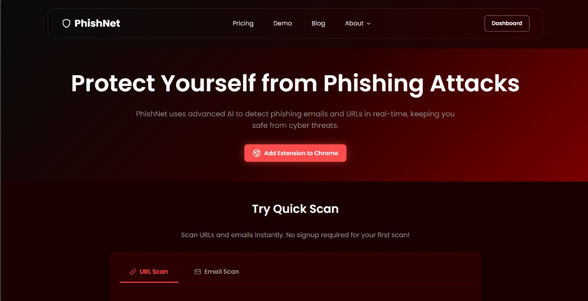

# PhishNet

**PhishNet** is a modern, responsive web application designed to **detect and manage phishing threats**, providing users with a secure platform to monitor, analyze, and report suspicious activities.

---

## Features

* **Real-time threat detection**: Quickly identify potential phishing attempts.
* **User-friendly dashboard**: Manage reports, statistics, and alerts efficiently.
* **Responsive design**: Fully compatible with desktop and mobile devices.
* **Secure authentication**: Login and sign-up features with data protection.
* **Comprehensive reports**: Generate, view, and export phishing activity reports.

---

## Technologies Used

* **Frontend**: HTML5, CSS3, JavaScript
* **Backend**: 
* **Database**: 
* **Version Control**: Git & GitHub

---

## Installation

1. **Clone the repository**

   ```bash
   git clone https://github.com/umer2239/PhishNet.git
   cd PhishNet
   ```

2. **Open in browser**

   * You can open `index.html` directly in any modern browser.
   * For dynamic backend functionality, follow backend setup instructions (if applicable).

---

## Usage

1. Sign up or log in to access the dashboard.
2. Add phishing reports or monitor alerts.
3. View analytics and export reports as needed.

---

## Contributing

Contributions are welcome! Please follow these steps:

1. Fork the repository.
2. Create a new branch:

   ```bash
   git checkout -b feature/YourFeatureName
   ```
3. Make your changes and commit them:

   ```bash
   git commit -m "Add some feature"
   ```
4. Push to your branch:

   ```bash
   git push origin feature/YourFeatureName
   ```
5. Open a Pull Request.

---

## License


---

## Contact

* **Author**: umer2239
* **Email**: umerhashmi265@gmail.com

---

## Screenshots


*Dashboard and analytics view*
